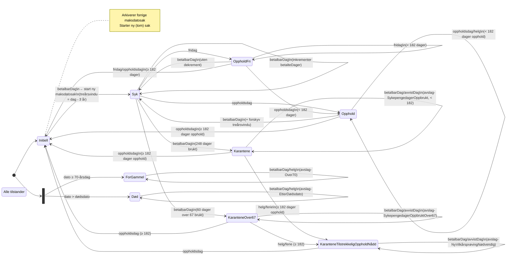
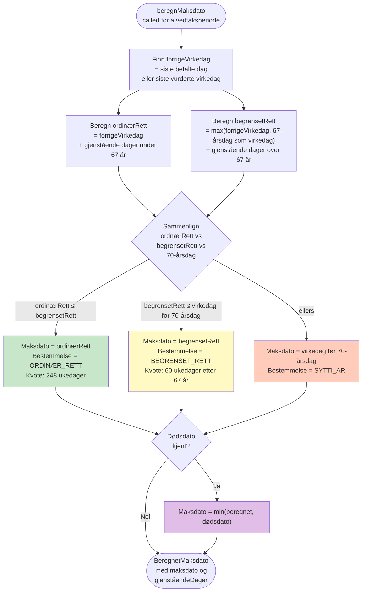

Diagram 1 — Tilstandsmaskin (state machine per dag i tidslinjen)



-----------------------------------------------------------------------------------------------------------------------------------------------------------------------------------------------------------------

Diagram 2 — Beregning av maksdato (fra Maksdatokontekst.beregnMaksdato)


-----------------------------------------------------------------------------------------------------------------------------------------------------------------------------------------------------------------

Oppsummering av flyten
```
┌───────────────────────────┬────────────────────────────────────────────────────────────────────────────────────┐
│ Konsept                   │ Verdi                                                                              │
├───────────────────────────┼────────────────────────────────────────────────────────────────────────────────────┤
│ Maks dager (ordinær)      │ 248 ukedager (§ 8-12)                                                              │
├───────────────────────────┼────────────────────────────────────────────────────────────────────────────────────┤
│ Maks dager over 67 år     │ 60 ukedager (§ 8-51)                                                               │
├───────────────────────────┼────────────────────────────────────────────────────────────────────────────────────┤
│ Tilstrekkelig opphold     │ 26 uker = 182 dager                                                                │
├───────────────────────────┼────────────────────────────────────────────────────────────────────────────────────┤
│ Treårsvindu               │ Kun betalte dager siste 3 år teller                                                │
├───────────────────────────┼────────────────────────────────────────────────────────────────────────────────────┤
│ Opphold med bare fridager │ Teller IKKE mot 182-dagersregelen for ny rettighet – kun opphold → Opphold-state   │
├───────────────────────────┼────────────────────────────────────────────────────────────────────────────────────┤
│ Initiell-tilstand         │ Arkiverer gjeldende sak og starter ny tom Maksdatokontekst                         │
└───────────────────────────┴────────────────────────────────────────────────────────────────────────────────────┘
```

Kjerne-ideen: For hver dag i tidslinjen kjøres staten fremover. Betalbare dager forbruker kvoten; opphold akkumuleres. Etter 182 dagers opphold nullstilles rettigheten (Initiell). Til slutt beregnes selve
maksdatoen ved å se fremover basert på gjenværende kvote fra siste betalte dag.