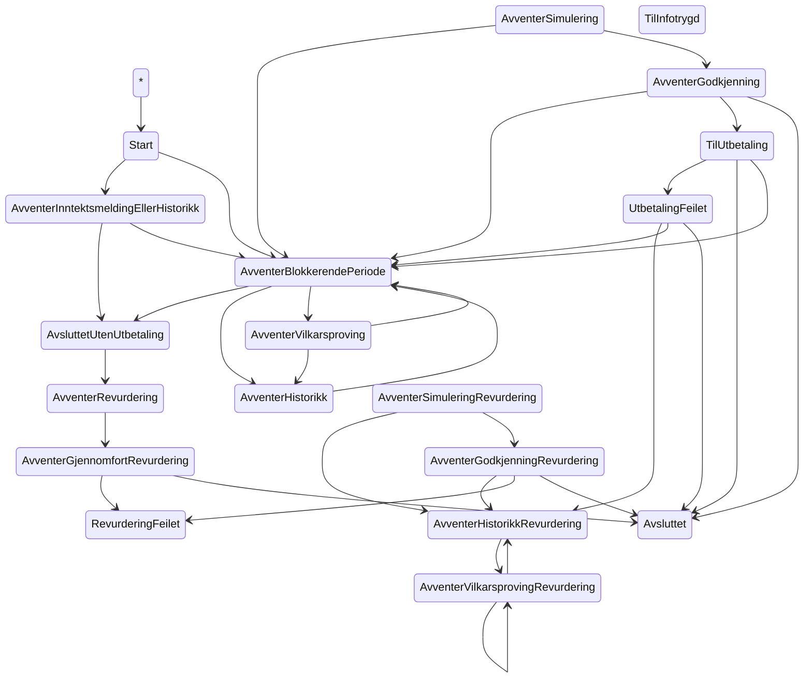

# The State of the Machine

Alle tilstandsendringer som er eksplisitt beskrevet i tilstandsmaskinen (at the time of writing...)

Det er to tilstander (TilInfotrygd og AvventerSimulering) som ikke har noen innkommende transisjoner. Disse tilstandene havner vi ofte i, så dermed vet vi at diagrammet mangler transisjoner. Dette er transisjoner som gjøres utenfor tilstandsmaskinen, men gjerne av Vedtaksperioden eller kanskje andre objekter.

