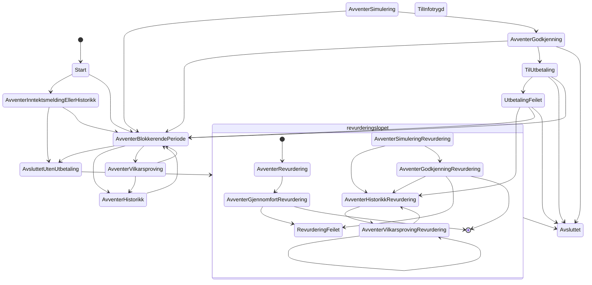

# The State of the Machine

Alle tilstandsendringer som er eksplisitt beskrevet i tilstandsmaskinen (at the time of writing...)

Det er tilstander, TilInfotrygd, AvventerSimulering, og AvventerSimuleringRevurdering, som ikke har noen innkommende transisjoner. Disse tilstandene
havner vi ofte i, så dermed vet vi at diagrammet mangler transisjoner. Dette er transisjoner som gjøres utenfor
tilstandsmaskinen, men gjerne av Vedtaksperioden eller kanskje andre objekter.

Merk at det også er tilstander som ikke har noen eksplisitte utgående transisjoner, men som vi vet ikke stopper behandling. Her er det også snakk om at transisjonene gjøres på utsiden av tilstandsmaskinen.

