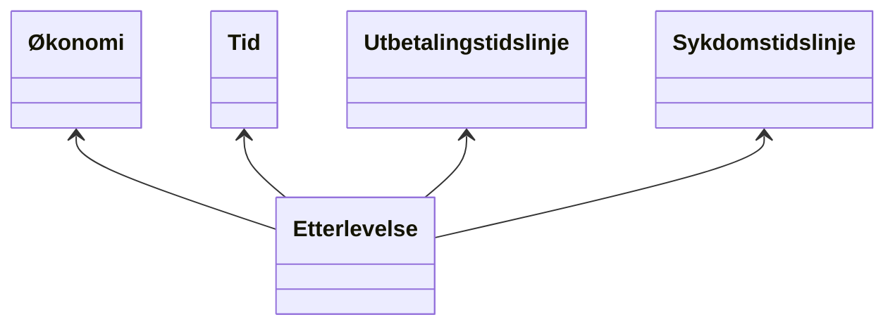

Vi tenker at Oppdrag burde være sin egen greie. Det har noen design-utfordringer.

Komponent-diagram; dette er ikke klasser, men kanskje moduler

```mermaid
classDiagram

    Økonomi <-- Etterlevelse
    Tid <-- Etterlevelse
    Utbetalingstidslinje <-- Etterlevelse
    Sykdomstidslinje <-- Etterlevelse
```