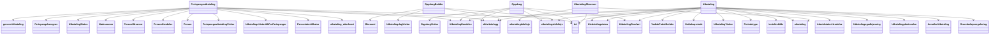

Vi tenker at Oppdrag burde være sin egen greie. Det har noen design-utfordringer.

Ta utgangspunkt i utbetalingslinjer og tegn alle imports:

```mermaid
classDiagram

    Feriepengeutbetaling --> tid
    Feriepengeutbetaling --> aktivitetslogg
    Feriepengeutbetaling --> utbetaling_etterhvert
    Feriepengeutbetaling --> Personidentifikator
    Feriepengeutbetaling --> UtbetalingshistorikkForFeriepenger
    Feriepengeutbetaling --> UtbetalingHendelse
    Feriepengeutbetaling --> FeriepengeutbetalingVisitor
    Feriepengeutbetaling --> Person
    Feriepengeutbetaling --> PersonHendelse
    Feriepengeutbetaling --> PersonObserver
    Feriepengeutbetaling --> Nødnummer
    Feriepengeutbetaling --> UtbetalingStatus
    Feriepengeutbetaling --> Feriepengeberegner
    Feriepengeutbetaling --> genererUtbetaling
    
    Oppdrag --> tid
    Oppdrag --> aktivitetslogg
    Oppdrag --> utbetalingstidslinje
    Oppdrag --> UtbetalingHendelse
    Oppdrag --> UtbetalingOverført
    Oppdrag --> OppdragVisitor
    
    OppdragBuilder --> aktivitetslogg
    OppdragBuilder --> utbetalingstidslinje
    OppdragBuilder --> UtbetalingdagVisitor
    OppdragBuilder --> Økonomi
    
    Utbetaling --> tid
    Utbetaling --> aktivitetslogg
    Utbetaling --> utbetaling
    Utbetaling --> utbetalingstidslinje
    Utbetaling --> Grunnbeløpsregulering
    Utbetaling --> AnnullerUtbetaling
    Utbetaling --> UtbetalingOverført
    Utbetaling --> UtbetalingHendelse
    Utbetaling --> Utbetalingpåminnelse
    Utbetaling --> Utbetalingsgodkjenning
    Utbetaling --> ArbeidstakerHendelse
    Utbetaling --> Inntektskilde
    Utbetaling --> Periodetype
    Utbetaling --> UtbetalingVisitor
    Utbetaling --> Vedtaksperiode
    Utbetaling --> VedtakFattetBuilder
    Utbetaling --> Utebetalingstatus
    Utbetaling --> Utebetalingstatus
   
    UtbetalingObserver --> tid
    UtbetalingObserver --> utbetaling
    UtbetalingObserver --> utbetalingtidslinje
```